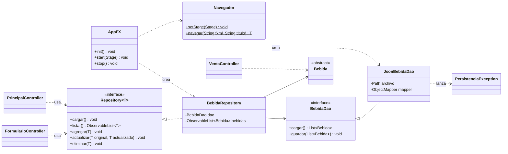

# Tarea Fiestas Patrias — Fonda San Belarmino (EA2)

**DSY1102 · Programación Orientada a Objetos · EA2: Desarrollo de interfaces gráficas con persistencia en archivo**

> Material de práctica. No corresponde a una evaluación sumativa. Prepara la Evaluación Parcial 2.

> **Rama `solucion`:** contiene la implementación de referencia. La explicación paso a paso de cómo cumple cada requisito está en [`GUIA_EA2.md`](GUIA_EA2.md). La rama `main` es la plantilla para estudiantes.

| | |
|---|---|
| **Sigla** | DSY1102 |
| **Experiencia de aprendizaje** | EA2: Desarrollo de interfaces gráficas con persistencia en archivo |
| **Indicadores de logro** | IL 2.1 al IL 2.8 |
| **Tiempo estimado** | 4 bloques |
| **Modalidad** | Individual, con acompañamiento docente |
| **Tecnologías** | Java 25 · Maven · JavaFX 25 · FXML / Scene Builder · Jackson |

---

## Cómo trabajar con este repositorio

Este proyecto **continúa la tarea de EA1**. El enunciado original del modelo de bebidas está en [`docs/enunciado-ea1.md`](docs/enunciado-ea1.md).

1. Pulsa **Fork** para crear el repositorio en tu cuenta de GitHub y clónalo.
2. Abre la carpeta desde tu IDE como **proyecto Maven** (IntelliJ IDEA o NetBeans lo detectan al encontrar el `pom.xml`).
3. Copia tus clases de EA1 al paquete `cl.dsy1102.fonda.model` y ajusta su línea `package`.
4. Desarrolla las capas siguiendo el orden de los requerimientos.
5. Haz commits a medida que avanzas. **El historial de commits se evalúa**: una entrega con un único commit no evidencia el proceso.

### Requisitos

| Herramienta | Versión |
|---|---|
| JDK | 25 (LTS) |
| Maven | 3.8 o superior (IntelliJ IDEA y NetBeans traen uno incorporado) |
| Scene Builder | 25 o superior (opcional, recomendado) |

En IntelliJ IDEA, el SDK del proyecto (*File → Project Structure → Project → SDK*) debe ser un JDK 25. Si tu equipo solo tiene JDK 21, cambia en el `pom.xml` `maven.compiler.release` a `21` y `javafx.version` a `21.0.6`: la versión mayor de JavaFX debe coincidir con la del JDK.

### Comandos

```bash
mvn compile              # compila el proyecto
mvn javafx:run           # ejecuta la aplicación gráfica (EA2)
mvn compile exec:java    # ejecuta el programa de consola (EA1)
mvn clean                # borra los archivos compilados
```

> La Evaluación Parcial 2 se rinde **sin acceso a internet**. Ejecuta `mvn compile` al menos una vez con conexión para que Maven descargue JavaFX y Jackson a tu repositorio local (`~/.m2`).

Cada push a tu fork dispara una verificación automática de compilación en GitHub Actions. **Si el código no compila o la interfaz no despliega sus pantallas, la evaluación obtiene la nota mínima.**

---

## Condiciones de la actividad

- Trabajo individual. Puedes consultar tus apuntes, el material de la asignatura y la documentación oficial de Java, JavaFX y Jackson.
- Respeta las convenciones de Java: `PascalCase` para clases, `camelCase` para métodos, atributos y `fx:id`. Los `fx:id` llevan un prefijo según el control: `txtNombre`, `btnGuardar`, `cmbTipo`, `chkCertificada`, `tblBebidas`, `colNombre`, `lblMensaje`.
- Puedes crear métodos o clases auxiliares siempre que no contradigan los requerimientos.
- No uses herramientas de inteligencia artificial para generar el código. El valor de la actividad está en detectar tus propios vacíos antes de la evaluación sumativa.

---

## 1. Contexto del caso

La Fonda San Belarmino ya cuenta con el modelo de bebidas construido en EA1, pero hoy solo funciona por consola y los datos se pierden al cerrar el programa. La administración necesita una **aplicación de escritorio** que permita a los encargados de barra:

- ver todas las bebidas registradas en una tabla y buscarlas por nombre mientras escriben;
- registrar, editar y eliminar bebidas mediante un formulario que no acepte datos incompletos o inválidos;
- registrar ventas respetando el control de consumo responsable de EA1;
- conservar la información entre una jornada y otra, guardándola en un archivo **JSON**.

La solución debe organizarse con el patrón **Modelo-Vista-Controlador** y una capa de acceso a datos (**Repository + DAO**), de modo que la interfaz gráfica no dependa de cómo ni dónde se guardan los datos.

---

## 2. Arquitectura esperada



| Paquete | Contenido | Responsabilidad |
|---|---|---|
| `cl.dsy1102.fonda` | `AppFX`, `Navegador`, `Main` (EA1) | Arranque, ciclo de vida y navegación entre vistas. |
| `...fonda.model` | Clases de EA1 | Datos y reglas de negocio (precio, validaciones, consumo responsable). |
| `...fonda.dao` | `BebidaDao`, `JsonBebidaDao`, `PersistenciaException` | Leer y escribir el archivo JSON. Única capa que conoce el archivo. |
| `...fonda.repository` | `Repository<T>`, `BebidaRepository` | Mantener la `ObservableList` y ofrecer operaciones CRUD. |
| `...fonda.controller` | Un controlador por vista | Leer campos, validar, mostrar alertas, navegar y delegar al repositorio. |
| `resources/.../view` | `*.fxml`, `styles.css` | Estructura visual de cada pantalla. |

---

## 3. Requerimientos

### R1. Configuración del proyecto (Maven y módulos)

- El `pom.xml` ya declara `javafx-controls`, `javafx-fxml`, `jackson-databind` y el plugin `javafx-maven-plugin`. Revísalo y explica en un comentario de commit para qué sirve cada dependencia.
- El `module-info.java` ya declara los `requires` y `opens` necesarios. Si agregas paquetes que usen reflexión (FXML o Jackson), actualízalo.
- `AppFX` hereda de `Application`: traza por consola `init()`, `start()` y `stop()`, y usa el `Stage` que recibe `start()` (nunca `new Stage()` para la ventana principal).

### R2. Modelo

- Mueve las clases de EA1 al paquete `model`. Se mantienen todas sus reglas: precios, validaciones con `IllegalArgumentException`, constante `LIMITE_UNIDADES_POR_CLIENTE` e interfaz `ConsumoResponsable`.
- Agrega a `Bebida` un método abstracto `obtenerTipo()` que retorne `"Alcohólica"` o `"Sin alcohol"`, para mostrarlo en la tabla sin preguntar por la clase concreta.
- Para que Jackson pueda reconstruir los objetos, cada clase concreta necesita un constructor sin parámetros y el archivo debe registrar el subtipo de cada bebida (ver R6).

### R3. Vista principal (`principal-view.fxml`)

- `TableView` con las columnas **Tipo, Nombre, Volumen (ml), Stock, Precio y Venta restringida**, enlazadas con `setCellValueFactory`.
- Campo de búsqueda que filtre la tabla **en tiempo real** por nombre (sin distinguir mayúsculas), usando `FilteredList` y `SortedList` para que el ordenamiento por columna siga funcionando.
- Botones **Nueva**, **Editar**, **Eliminar** y **Vender**. Si una acción requiere una fila y no hay ninguna seleccionada, se informa con un `Alert`.
- Eliminar pide confirmación antes de borrar.
- La ventana se adapta al redimensionamiento (usa `BorderPane`, `VBox`, `HBox`, `GridPane` o anclas; evita posiciones absolutas).

### R4. Formulario (`formulario-view.fxml`)

- Una sola vista sirve para **crear y editar**. Al editar, el controlador recibe la bebida seleccionada y precarga sus datos (paso de parámetros entre controladores).
- `ComboBox` para el tipo. Según el tipo elegido se muestran los campos específicos: grados de alcohol, certificada y venta restringida (alcohólica) o azúcar por litro (sin alcohol). Al editar, el tipo no se puede cambiar.
- Una bebida con venta restringida no puede liberarse: la interfaz `ConsumoResponsable` solo permite restringir.
- Botones **Guardar** y **Volver**.

### R5. Venta (`venta-view.fxml`)

- Recibe la bebida seleccionada y muestra su ficha (`obtenerDetalle()`).
- Campo de unidades y botón **Vender**. El resultado se informa en pantalla con el mismo criterio de EA1:
  - `Venta autorizada: 2 x Pisco Sour | Total: $7000`
  - `Venta rechazada: 5 unidades de Pisco Sour superan el limite de 3 por cliente.`
  - `Venta rechazada: Chicha tiene la venta restringida.`
- La regla de consumo responsable se resuelve en el modelo a través de la interfaz, no en el controlador.

### R6. Persistencia JSON con Repository y DAO

- `BebidaDao` declara `cargar()` y `guardar(List<Bebida>)`. `JsonBebidaDao` lo implementa con `ObjectMapper` de Jackson y escribe el JSON con formato legible (*pretty print*).
- Los datos se guardan en `data/bebidas.json`. **Solo `AppFX` y el DAO conocen esa ruta**; los controladores trabajan con la interfaz `Repository`.
- `Repository<T>` es una interfaz genérica con `cargar`, `listar`, `agregar`, `actualizar` y `eliminar`. `BebidaRepository` la implementa, mantiene la `ObservableList` y **guarda en el archivo después de cada cambio**.
- Casos que el DAO debe resolver:

| Situación | Comportamiento esperado |
|---|---|
| El archivo no existe (primera ejecución) | Retorna una lista vacía, sin error. |
| La carpeta `data/` no existe al guardar | La crea antes de escribir. |
| El archivo existe pero está dañado | Lanza `PersistenciaException` con un mensaje comprensible. |
| No se puede escribir en disco | Lanza `PersistenciaException`; la tabla no debe mostrar un cambio que no se guardó. |

- Formato esperado del archivo (el atributo `tipo` permite a Jackson saber qué subclase crear):

```json
[ {
  "tipo" : "ALCOHOLICA",
  "nombre" : "Chicha",
  "volumenML" : 1000,
  "stock" : 40,
  "gradosAlcohol" : 12.0,
  "certificada" : false,
  "ventaRestringida" : true
}, {
  "tipo" : "SIN_ALCOHOL",
  "nombre" : "Mote con Huesillo",
  "volumenML" : 400,
  "stock" : 50,
  "azucarPorLitro" : 70
} ]
```

### R7. Validación y manejo de errores

- El controlador valida **antes** de operar sobre el modelo: campos vacíos, valores numéricos que no se pueden convertir y tipo no seleccionado. Cada problema se informa con un `Alert` que explica qué campo corregir.
- Si el modelo rechaza un valor (`IllegalArgumentException` de un setter, por ejemplo volumen fuera de rango), el mensaje se muestra en un `Alert`; la aplicación no se cae.
- Toda `PersistenciaException` se muestra en un `Alert` de error. El controlador nunca captura `IOException` directamente: esa excepción se traduce en el DAO.

### R8. Navegación

- Una clase `Navegador` centraliza el cambio de vista con `FXMLLoader` sobre el `Stage` principal y retorna el controlador de destino para entregarle datos.
- Flujos mínimos: Principal → Formulario → Principal, y Principal → Venta → Principal, sin excepciones en consola.

---

## 4. Datos para probar

Registra estas bebidas desde el formulario (son las mismas de EA1). Luego cierra la aplicación, vuelve a abrirla y verifica que sigan en la tabla.

| Tipo | Nombre | Volumen (ml) | Stock | Atributo específico |
|---|---|---|---|---|
| Alcohólica | Chicha | 1000 | 40 | Grados: 12.0 · Certificada: No · Venta restringida: Sí |
| Alcohólica | Pisco Sour | 500 | 25 | Grados: 18.0 · Certificada: Sí |
| Sin alcohol | Chicha | 1000 | 60 | Azúcar: 95 g/L |
| Sin alcohol | Mote con Huesillo | 400 | 50 | Azúcar: 70 g/L |

Pruebas de robustez que usará el docente:

1. Guardar el formulario con el nombre vacío, con `"abc"` en el volumen y con volumen `50`.
2. Buscar `chi` y comprobar que aparecen ambas Chichas.
3. Vender 2 y 5 unidades de Pisco Sour, y 1 de Chicha alcohólica.
4. Cerrar la aplicación, borrar `data/bebidas.json` y volver a abrirla (debe iniciar con la tabla vacía).
5. Escribir texto inválido dentro de `data/bebidas.json` y abrir la aplicación (debe mostrar un `Alert`, no cerrarse).

---

## 5. Estructura del proyecto

```
poo_tareafonda/
├── docs/enunciado-ea1.md
├── pom.xml
└── src/main/
    ├── java/
    │   ├── module-info.java
    │   └── cl/dsy1102/fonda/
    │       ├── AppFX.java                 (ya incluido, completar)
    │       ├── Navegador.java             ← debes crearla
    │       ├── Main.java                  (EA1)
    │       ├── model/                     ← clases de EA1
    │       ├── dao/                       ← BebidaDao, JsonBebidaDao, PersistenciaException
    │       ├── repository/                ← Repository, BebidaRepository
    │       └── controller/                ← un controlador por vista
    └── resources/cl/dsy1102/fonda/view/
        ├── principal-view.fxml            ← debes crearla
        ├── formulario-view.fxml           ← debes crearla
        ├── venta-view.fxml                ← debes crearla
        └── styles.css                     ← debes crearla
```

---

## 6. Autoevaluación antes de entregar

Criterios de la Evaluación Parcial 2:

| Dimensión | Pregunta de control |
|---|---|
| Estabilidad del sistema visual | ¿La aplicación inicia y navega entre todas las pantallas sin excepciones? |
| Cohesión arquitectónica | ¿Los controladores solo contienen lógica de interfaz y delegan en el repositorio? ¿El DAO está separado? |
| Usabilidad y validación | ¿La interfaz impide registrar datos incompletos o de tipo erróneo e informa al usuario? |
| Persistencia de datos | ¿Las bebidas, incluido su subtipo y la venta restringida, se conservan íntegras al reiniciar? |
| Control de versiones | ¿El historial muestra commits que reflejan el avance por capas? |

Criterios de calidad adicionales:

- **Desacoplamiento del almacenamiento:** ningún controlador contiene `File`, `Path`, `ObjectMapper` ni el nombre `bebidas.json`.
- **Sincronización vista-modelo:** los cambios se hacen sobre la `ObservableList`, nunca agregando filas directamente al `TableView`.
- **Errores de E/S:** se capturan y se informan con alertas amigables.

---

## Entrega

- Comprime el proyecto completo **incluyendo la carpeta `.git`** en un archivo ZIP (el historial de commits es parte de la evaluación). No incluyas `target/`.
- Nombra el archivo con tu nombre completo, sin espacios ni tildes (ejemplo: `Juan_Perez_Lopez.zip`).
- Súbelo a la actividad habilitada en AVA e incluye en el comentario el enlace a tu fork.

---

## Licencia

Material docente publicado bajo [CC BY-NC-SA 4.0](https://creativecommons.org/licenses/by-nc-sa/4.0/deed.es). El código que escribas en tu fork es tuyo y no queda cubierto por esta licencia.
